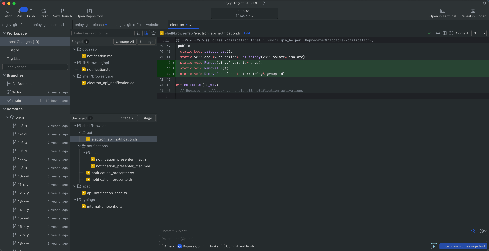
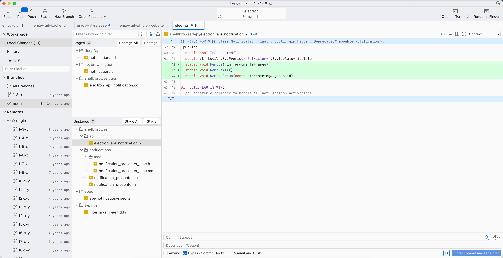

<p align="center">
  
</p>

English | [简体中文](./README.zh-CN.md) | [繁體中文（香港）](./README.zh-HK.md)

# [Website](https://enjoygit.com) · [Privacy Policy](https://enjoygit.com/privacyPolicy.html) · [Site source](./website/)

# Enjoy Git - Simple & Efficient Git Client

A modern Git GUI client built with Electron, Vue 3, and TypeScript. It supports multiple repository tabs in parallel, line-level staging and diff review, a visual commit graph, and full branch, remote, tag, and stash management.

---

## Supported Platforms

| Platform | Version / Format | Architectures | Git |
|----------|------------------|---------------|-----|
| **Windows** | Windows 10, Windows 11 | x64, arm64 | **Bundled** (dugite-native), ready to use |
| **macOS** | macOS 10.15 and later | x64 (older Intel Macs), arm64 (Apple Silicon M1 and newer) | **Bundled** (dugite-native), ready to use |
| **Linux** | Debian-based (`.deb`), Red Hat-based (`.rpm`) | x64, arm64 | Uses **system Git**; install Git in your environment first |

> **About Git**: Windows and macOS **include Git built in** (dugite-native)—install the app and you’re ready to go. On Linux, use your system’s Git; install it first (e.g. `sudo apt install git`, `sudo dnf install git`) and ensure the `git` command works in your terminal.

---

## Supported Languages

The app UI is available in three languages. Switch via the menu bar **Language**:

1. **Simplified Chinese**
2. **Traditional Chinese**
3. **English**

---

## Supported Themes

1. **Dark mode**
2. **Light mode**

---

## Menu Bar

The app provides a full menu bar. Common actions are available from menus or keyboard shortcuts (macOS examples below; Windows / Linux menu placement may differ slightly).

### Enjoy Git (Application Menu)


| Menu Item | Description |
|-----------|-------------|
| About Enjoy Git | View version and about information |
| Quit Enjoy Git | Exit the application (`⌘Q`) |

### File


| Menu Item | Shortcut | Description |
|-----------|----------|-------------|
| Create New Repository | `⌘N` | Create a new empty repository locally |
| Open Repository | `⌘O` | Open an existing local repository |
| Clone Repository | `⇧⌘O` | Clone a remote repository |
| Add All Repositories in Local Directory | — | Batch-add all Git repositories under a chosen directory |

### View


| Menu Item | Shortcut | Description |
|-----------|----------|-------------|
| Show Local Changes | `⌘1` | Switch to the local changes view |
| Show Commit History | `⌘2` | Switch to the commit history view |
| Show Tag List | `⌘3` | Switch to the tag list view |
| Reset Zoom | `⌘0` | Reset UI zoom (shows current scale, e.g. 110%) |
| Zoom In / Zoom Out | `⌘=` / `⌘-` | Zoom in / zoom out |
| Switch to Dark Mode / Light Mode | — | **Switch dark / light theme** |
| Toggle Developer Tools | `⌥⌘I` | Open developer tools |

### Repository


| Menu Item | Shortcut | Description |
|-----------|----------|-------------|
| Push | `⇧⌘P` | Push to remote |
| Pull | `⇧⌘L` | Pull from remote |
| Fetch | `⇧⌘T` | Fetch remote updates |
| Quick Switch Repository | `⌘P` | Quickly switch among open repositories |
| Refresh Repository Status | `⌘U` | Refresh repository status |
| Open in Terminal | `⌃\`` | Open the current repository in the terminal |
| Reveal in Finder | `⇧⌘F` | Show the repository in Finder / File Explorer |
| Edit .gitignore | `⌘I` | Edit `.gitignore` |
| Close Repository | `⌘⌫` | Close the current repository tab |

### Language


Select one UI language under **Language**; it takes effect immediately:

- Simplified Chinese
- 繁體中文
- English

### Help


| Menu Item | Description |
|-----------|-------------|
| Configure External Open Program | Configure external open programs (see below) |
| View Today's Log | View today's log |
| Open Logs Directory | Open the logs directory |
| View Config File | View the configuration file |
| Open Config Directory | Open the configuration directory |
| SSH Key Management | SSH key management (see below) |
| AI Commit | AI commit message configuration (see below) |
| Report Issue | Report an issue |
| Contact Me | Contact the developer |
| Release Notes | View release notes |

---

## Settings & Tools

The following features are accessed from the **Help** menu.

### External Open Programs

Register editors such as Cursor, VS Code, or Trae as external programs for **Open** and **Open with External Program** in file context menus. You can set one program as the **default**.


| Capability | Description |
|------------|-------------|
| Add external program | Choose an installed app on your machine (`.app` / executable) |
| Edit / Delete | Maintain name and path |
| Set as default | Check **Default** to use as the preferred program for **Open** |
| Use cases | Workspace files, historical versions, and files in commit snapshots can all be opened externally |

### SSH Key Management

Configure SSH public keys for Git remotes (GitHub, GitLab, etc.) without manually editing `~/.ssh`.


| Capability | Description |
|------------|-------------|
| Create Key | Generate a new SSH key pair in the app |
| Import Key | Import an existing key from your machine |
| Key list | Shows public key filename and path (e.g. `id_rsa.pub`) |
| Quick actions | Open containing folder, copy public key content, delete key |

### AI Commit Messages

Connect to large language models to **automatically generate commit messages** from staged changes, saving time writing commit messages by hand.


| Setting | Description |
|---------|-------------|
| Reply language | Language for generated messages (e.g. `English`, `zh-CN`; leave empty to follow the app UI language) |
| AI model list | Add multiple models; check one as the active model |
| Add AI Model | Add a new model configuration |


When adding a model, fill in:

| Field | Description |
|-------|-------------|
| Provider | Select the AI provider (required) |
| Model | Model name, e.g. `deepseek-chat` (required) |
| API Key | API key for the selected service |

After configuration, use AI to generate commit messages in the commit area (exact button placement is shown in the app).

---

## Feature Overview

| Module | Core Capabilities |
|--------|-------------------|
| Menu bar | Full File / View / Repository / Language / Help menus and shortcuts |
| Multi-repository | Open multiple local repositories in tabs, each retaining its view state |
| Working directory | Staged / unstaged sections, **list / file tree** views, keyword filter, file context menus |
| Diff review | Unified / side-by-side views, syntax highlighting, line-level staging, context folding, image diff |
| Commit | Summary and description, Amend, skip hooks, commit and push, **AI-generated messages** |
| History | Commit graph, search and filter, commit details, change **list / file tree** views, directory snapshots, multi-select batch actions |
| Branches / remotes | Checkout, merge, rebase, tracking, rename, remote fetch / edit / batch checkout |
| Tags / stash | Tag checkout and delete, stash apply / pop / rename |
| Settings | **External programs**, **SSH keys**, **AI commit**, logs and config directories |
| Advanced | Cherry-pick, Squash, Revert, Blame, visual conflict resolution |

---

## Feature Details

### 1. Main Interface & Multi-Repository Management

Three-column layout in dark and light themes: left navigation, center file list, right diff and commit area.

| Theme | Preview |
|-------|---------|
| Dark mode |  |
| Light mode |  |

#### Top Toolbar

| Action | Description |
|--------|-------------|
| **Fetch** | Fetch latest refs from remote without merging into the current branch |
| **Pull** | Pull and integrate remote changes (normal / Rebase modes supported) |
| **Push** | Open the [Push dialog](#push-dialog) to configure branch, remote, and push options |
| **Stash** | Open [Stash dialogs](#stash-dialogs) to stash all or selected files |
| **Create Branch** | Create a branch from HEAD, a tag, a commit, or a remote branch |
| **Add Local Repository** | Add an existing local Git repository to the workspace |

#### Push Dialog

Click toolbar **Push**, menu **Repository → Push** (`⇧⌘P`), or branch context menu **Push to Remote**, to open the push configuration dialog.


| Element | Description |
|---------|-------------|
| Title | e.g. `Push 'main' to 'origin'`, showing local branch and target remote |
| **Branch** (required) | Select the local branch to push |
| **Remote** (required) | Select target remote (e.g. `origin`) |
| **Push to** (required) | Target remote branch (e.g. `origin/main`); **+** on the right creates a new remote branch |
| **Push all tags to 'origin'** | Push all local tags as well |
| **Push all branches to 'origin'** | Push all local branches |
| **Force Push** | Force push (`--force`; use with caution) |
| **Push** | Execute push |
| **Hide** | Close the dialog |

#### Multi-Repository Tabs

- Open multiple repositories in top tabs (e.g. `enjoy-git`, `electron`) and switch with one click
- Each tab keeps its own branch, staging, and view state

#### System Quick Actions

| Entry | Description |
|-------|-------------|
| **Open in Terminal** | Open the current repository directory in the system terminal |
| **Reveal in Finder** / **File Explorer** | Locate the repository root in the system file manager |

#### Left Sidebar Workspace

| Entry | Description |
|-------|-------------|
| **Local Changes** | Shows uncommitted change count; enter staging and commit flow |
| **Commit History** | View commit graph, list, and individual commit details |
| **Tag List** | Browse and manage Git tags |

The sidebar also provides tree lists for **local branches**, **remotes**, **tags**, and **stash**, with keyword filtering.

---

### 2. Working Directory & Staging Area


#### File List

- **Staged / Unstaged** sections with count badges
- **Status icons**: green **+** for new files; yellow dot for modified
- **Change stats**: file count and total line changes `+added -deleted` (e.g. `5 changed files +387 -8`)
- **Keyword filter**: search box at the top to filter by filename

#### List / File Tree View

Changed files can be shown in two layouts, toggled via icons on the right of the filter bar (available in **Local Changes** and **Commit History** change lists):

| View | Description |
|------|-------------|
| **List view** | Flat list of all changed files; good for small changes and quick lookup |
| **File tree view** | Hierarchical folder view; good for large changes and browsing by module |


- Folders can expand / collapse; changes under child paths are highlighted
- Works with **Changes** / **File Tree** tabs: the former shows this change set; the latter in commit history shows a full read-only directory snapshot at that commit

#### Batch Actions

| Section | Button | Description |
|---------|--------|-------------|
| Staged | Unstage All / Unstage Selected | Move back to unstaged |
| Unstaged | Stage All / Stage Selected | Add to staging area |

#### Unstaged File Context Menu


| Menu Item | Description |
|-----------|-------------|
| Discard Changes | Restore to HEAD version |
| Stage | Stage the current file |
| History | Open single-file commit history |
| Blame | Line-level attribution via `git blame` |
| Reveal in Finder | `Cmd+Shift+F` (macOS; equivalent file manager on Windows / Linux) |
| Open | Open with the default external program |
| Open with | Submenu: pick an editor from [External open programs](#external-open-programs) |
| Stash | Stash the current file (staged / unstaged areas preserved) |
| Copy Path | Copy absolute file path |
| Copy Relative Path | Copy path relative to repository root |

---

### 3. Diff Comparison

- **Unified / side-by-side** views with optional **ignore whitespace**
- **Syntax highlighting**: Vue, JavaScript, TypeScript, Markdown, Python, and more
- **Change highlighting**: green `+` additions, red `-` deletions
- **Image diff** preview; **virtual list** for smooth scrolling on large files
- **Edit workspace files** directly in the diff view

#### Side-by-Side Comparison


#### Context Folding


| Action | Description |
|--------|-------------|
| Expand up | Show more context lines above the current change block |
| Expand down | Show more context lines below the current change block |

#### Line-Level Staging (Hunk Actions)

Select lines in the diff (highlighted), then right-click to stage, unstage, or discard at line level:


| Menu Item | Description |
|-----------|-------------|
| Copy | Copy selected content |
| Stage Selected Changes | Stage only selected lines (partial commit) |
| Discard Selected Changes | Discard changes in selected lines |
| Expand Whole File | Show full file diff |

For already staged lines, the menu shows **Unstage Selected Changes** instead.

---

### 4. Commit

Commit area at the bottom of the main interface:

| Feature | Description |
|---------|-------------|
| Commit message | Single-line summary + optional detailed description |
| AI-generated message | Generate commit message from staged changes (configure model in [AI commit messages](#ai-commit-messages) first) |
| Amend Last Commit | Merge this change into the previous commit |
| Skip Commit Hooks | Equivalent to `git commit --no-verify` |
| Commit and Push | Push to remote automatically after commit |
| Commit button | Shows file count and target branch, e.g. "Commit 6 files to 'dev'" |

When unresolved conflicts exist, the button prompts you to resolve conflicts first.

---

### 5. Commit History


- **Commit graph**: colored lines and nodes showing branches and merges
- **Commit list**: message, author avatar, short SHA, relative time
- **Search filter**: search by commit message keyword (Enter to trigger)
- **Branch filter**: limit history to a specific branch

#### Commit Context Menu


| Action | Description |
|--------|-------------|
| Checkout Commit | Switch to that commit (detached HEAD) |
| Revert Commit | Create a reverse commit |
| Undo Commit | Undo the latest commit while keeping changes |
| Create Branch / Tag from Commit | Open create branch or tag dialog |
| Cherry-pick Commit | Open dialog, choose target branch, apply changes |
| Edit Commit Message | Modify commit message |
| Delete Commit | Remove from history |
| Copy SHA / Copy Commit Message | Quick copy |

#### Multi-Select Batch Actions


With multiple commits selected: **Cherry-pick**, **Squash**, **Delete**, copy SHA and message; the right panel summarizes changed files and diffs.

#### Cherry-pick

After selecting one or more commits in history, use context menu **Cherry-pick Commit** or batch menu **Cherry-pick N Commits** to open the cherry-pick dialog and choose the **target branch**.


| Element | Description |
|---------|-------------|
| Title | Shows commit count, e.g. `Cherry-pick 4 Commits` |
| Hint | If a local branch shares a name with a remote branch, cherry-pick to that branch is not allowed; such remote branches are hidden by default |
| Keyword filter | Quickly search the branch list |
| Branch list | Local and remote branches with relative time; current branch marked with a check |
| Confirm button | Label updates with selection, e.g. `Cherry-pick 4 commits to 'origin/1-4-x'` |

After confirmation, selected commits are applied in order to the target branch; conflicts trigger [Conflict resolution](#conflict-resolution).

#### Commit Details & File Browsing


The right panel shows full message, author, email, time, SHA, parent commits, PR links, and more.

| Tab | Description |
|-----|-------------|
| **Changes** | Files changed in this commit; supports [list / file tree](#list--file-tree-view) layouts, shows `+lines -lines`, click to view diff |
| **File Tree** | **Full** read-only directory snapshot at this commit |


#### History File Context Menu


| Menu Item | Description |
|-----------|-------------|
| Reveal in Finder | Locate the file |
| Open · Latest Version / Selected Version | Compare versions |
| Open with External Program | Submenu to choose an app |
| View File History / Blame | History and blame |
| Reset File to Commit / Pre-Commit State | Revert file |
| Show in File Tree | Jump to file tree and highlight |
| Copy Path / Copy Relative Path | Quick copy |

---

### 6. Branch Management


| Action | Description |
|--------|-------------|
| Checkout | Switch to this branch |
| Push to Remote | Open [Push dialog](#push-dialog) |
| Merge into Another Branch | Merge |
| Rebase Another Branch onto Current | Rebase |
| Create Branch | Open [Create branch](#create-branch-dialog) dialog |
| Track Remote Branch | Set upstream tracking |
| Rename / Delete | Branch lifecycle management |
| Copy Branch Name / Copy Remote Branch Name | Quick copy |

Create branches from **HEAD / tag / commit / remote branch** (toolbar **Create Branch**, sidebar button, or context menu **Create Branch**).

#### Create Branch Dialog


| Element | Description |
|---------|-------------|
| **Name** (required) | Enter new branch name |
| **New branch based on** | Shows start point type and description, e.g. `Branch (main) docs: update Notification...` |
| **Checkout after create** | When checked, check out the new branch after creation |
| **Create Branch** | Confirm creation |
| **Hide** | Close the dialog |

The start point depends on where you opened the dialog: right-click a branch in the sidebar to base on that branch; **Create Branch from Commit** in history bases on that commit.

---

### 7. Remote Repository Management


Right-click a remote name (e.g. `origin`):

| Action | Description |
|--------|-------------|
| Fetch origin | Fetch from this remote only |
| Edit origin | Change name or URL (HTTP / SSH) |
| Disassociate / Remove | Remove remote configuration |
| Checkout All Branches | Create local tracking branches for all remote branches |
| Copy Name / Copy Remote URL | Quick copy |

Supports **multiple remotes** with full CRUD. Use **Remotes** in the sidebar to add a remote via the [Add remote dialog](#add-remote-dialog).

#### Add Remote Dialog


| Element | Description |
|---------|-------------|
| **Name** (required) | Remote name, e.g. `origin`, `upstream` |
| **URL** (required) | Remote repository URL; HTTPS / SSH supported |
| **Add remote** | Add remote and save configuration |
| **Hide** | Close the dialog |

After adding, expand the remote in the sidebar to Fetch, checkout branches, or [Push](#push-dialog).

#### Remote Branches


| Action | Description |
|--------|-------------|
| Checkout | Check out remote tracking branch |
| Create Branch | Create local branch from remote branch |
| Delete | Delete remote branch |
| Copy Name | Copy branch name |

---

### 8. Tag Management


| Action | Description |
|--------|-------------|
| Checkout Tag | Switch to the commit pointed to by the tag |
| Delete Tag | Remove local or remote tag |
| Copy Tag Name / Copy Tag SHA | Quick copy |
| View Tag Details | View associated commit and message |

The sidebar **Tag List** supports search and filter; create tags from commit history via **Create Tag from Commit**.

---

### 9. Stash Management


| Action | Description |
|--------|-------------|
| Apply Stash | Apply changes; keep stash entry |
| Apply and Drop Stash | Same as `git stash pop` |
| Delete Stash | Discard this stash |
| Copy Stash Name | Quick copy |

Supports **renaming** stashes for easier identification.

#### Stash Dialogs

Use toolbar **Stash** or related menus to stash changes; file context menu **Stash Selected Files** stashes only selected files. Stashing preserves the distinction between staged and unstaged areas.

##### Stash All Files


| Element | Description |
|---------|-------------|
| Title | `Stash All Files` |
| Message input | Optional stash message (`Please input stash message (Option)`) |
| **Stash All Files** | Stash all current uncommitted changes |
| **Hide** | Close the dialog |

##### Stash Selected Files


| Element | Description |
|---------|-------------|
| Title | Shows file count, e.g. `Stash 1 files` |
| Message input | Optional stash message |
| **Select All (N/M)** | Select / deselect all; `N` selected, `M` total available |
| File list | Check files to stash (staged and unstaged) |
| **Stash N files** | Stash only checked files |
| **Hide** | Close the dialog |

When opened from a file context menu, the current file is selected by default; you can add or remove other files in the list.

---

### 10. Clone & Repository Onboarding


| Field | Description |
|-------|-------------|
| Repository URL (required) | HTTPS / SSH |
| Local directory (required) | Parent directory for the clone |
| Target folder | Can be derived from URL by default |
| Repository alias | Display name in the app only |
| Recursively clone submodules | Clone submodules as well |

- **Add local repository**: Open an existing Git project on your machine
- **Git**: Windows / macOS use **bundled Git** (dugite-native); Linux uses Git installed on your system
- Detailed error messages on clone failure related to permissions and network

---

### 11. Blame & File History


**Blame** opens in a dedicated window:

- Left: all commits affecting this file, with keyword filter
- Center: last modifier and date per line
- Right: syntax-highlighted file content
- Branch selector at the top to switch branches

**File history**: from file context menu; view the full commit chain for one file and each diff.

---

### 12. Conflict Resolution

**Merge, rebase, pull, stash apply, cherry-pick**, and any other operation that produces conflicts share the same visual resolution workflow.


| Capability | Description |
|------------|-------------|
| Conflict file markers | Warning icons in sidebar and file list for unresolved files |
| Chunk resolution | Highlight conflict blocks in the editor; **Accept Current / Accept Incoming / Accept Both** |
| Bulk accept | One-click **Accept all current / Accept all incoming** |
| Conflict navigation | Shows `1/N conflicts` with **Jump** to the next conflict |
| Flow control | In-progress operations (e.g. rebase) can **skip current step** or **abort** the whole operation |
| Commit area linkage | Commit button shows "resolve conflicts first" until all are resolved |


- Side-by-side **current** vs **incoming** versions
- VS Code–style conflict markers and inline action buttons

---

### 13. Other Capabilities

| Category | Capabilities |
|----------|--------------|
| Cherry-pick | Single or batch cherry-pick commits |
| Squash | Squash multiple selected commits into one |
| Reset | Soft reset, hard reset, undo commit |
| Performance | Virtual lists for commit list, diff, and file tree; suitable for large repositories |
| Bundled Git | dugite-native on Windows / macOS (out of the box); Linux relies on system Git |

---

## Screenshot Index

All UI screenshots are in [`docs/images/`](docs/images/):

| Filename | Description |
|----------|-------------|
| `main-interface-dark.png` | Main interface (dark) |
| `main-interface-light.png` | Main interface (light) |
| `staged-files-with-diff.png` | Staging area with diff |
| `changed-files-list-view.png` | Changed files list view |
| `changed-files-tree-view.png` | Changed files file tree view |
| `unstaged-file-context-menu.png` | Unstaged file context menu |
| `diff-side-by-side.png` | Side-by-side diff |
| `diff-side-by-side-options.png` | Side-by-side diff (full) |
| `diff-expand-up.png` | Expand context (up) |
| `diff-expand-down.png` | Expand context (down) |
| `diff-line-staging-hunk.png` | Line-level staging (context menu) |
| `commit-history-overview.png` | Commit history overview |
| `commit-context-menu.png` | Commit context menu |
| `commit-multi-select.png` | Multi-select commit actions |
| `cherry-pick-dialog.png` | Cherry-pick dialog |
| `commit-detail-view.png` | Commit details |
| `commit-file-tree.png` | Commit file tree |
| `history-file-context-menu.png` | History file context menu |
| `blame-view.png` | Blame view |
| `branch-context-menu-en.png` | Branch context menu |
| `create-branch-dialog.png` | Create branch dialog |
| `push-dialog.png` | Push dialog |
| `remote-context-menu-en.png` | Remote context menu |
| `add-remote-dialog.png` | Add remote dialog |
| `remote-branch-context-menu.png` | Remote branch menu |
| `tag-context-menu.png` | Tag menu |
| `stash-context-menu.png` | Stash menu |
| `stash-all-dialog.png` | Stash all files |
| `stash-files-dialog.png` | Stash selected files |
| `clone-repository.png` | Clone repository |
| `rebase-conflict-resolution.png` | Conflict resolution interface |
| `conflict-side-by-side.png` | Side-by-side conflict comparison |
| `menu-app.png` | Application menu |
| `menu-file.png` | File menu |
| `menu-view.png` | View menu (with theme switching) |
| `menu-repository.png` | Repository menu |
| `menu-language.png` | Language menu |
| `menu-help.png` | Help menu |
| `settings-external-programs.png` | External open programs |
| `settings-ssh-keys.png` | SSH key management |
| `settings-ai-commit.png` | AI commit configuration |
| `settings-add-ai-model.png` | Add AI model |

More official screenshots are on the [website](https://enjoygit.com).

---

## FAQ

Answers to common questions about Enjoy Git. More on the [website](https://enjoygit.com).

### What advantages does Enjoy Git have compared to other Git clients?

Enjoy Git focuses on a more intuitive interface and broader feature coverage, with particular strengths in **conflict resolution**, **partial commits**, and **file history tracking**. Complex Git commands are wrapped in simple visual workflows while advanced features remain accessible—so both newcomers and experienced developers can work efficiently.

### Does Enjoy Git monitor my data?

Enjoy Git does **not** monitor your repository content. Projects you manage in the app belong to you. Git operations, credentials, and logs are primarily stored on your device and are not uploaded to read your commits or repository files. For limited usage statistics (such as daily active device counts), see the [Privacy Policy](https://enjoygit.com/privacyPolicy.html).

### How do I get help or report an issue?

- Open a [GitHub Issue](https://github.com/huangcs427/enjoy-git-release/issues)
- Email: [huangcs427@163.com](mailto:huangcs427@163.com)

---

## Download & Install

- Download the installer for your platform and architecture from [GitHub Release](https://github.com/huangcs427/enjoy-git-release/releases)

Follow the installer to complete setup.

---

## Help

- Having trouble? Open a [GitHub Issue](https://github.com/huangcs427/enjoy-git-release/issues)

---

## dugite-native Source Code

```ts
/**
 * 本软件内置的Git使用了dugite-native
 * 项目地址：https://github.com/desktop/dugite-native
 * 本文件包含了获取git路径和环境变量的函数，以及导出git命令函数的代码。
 */
import { spawn } from 'child_process';
import * as fs from 'fs-extra';
import * as path from 'path';

// 获取windows的git实例子目录，根据架构返回不同的目录
const getWin32GitSubfolder = (arch?: string): string => {
  const archRes = arch || process.arch
  if (archRes === 'x64') {
    return 'mingw64'
  } else if (archRes === 'arm64') {
    return 'clangarm64'
  } else {
    return 'mingw32'
  }
}

// 获取git路径和环境变量
interface TObjectValue {
  [key: string]: any
}
const getGitPathAndGitEnv = (envTemp?: TObjectValue) => {
  let env = { ...process.env, ...(envTemp || {}) }
  // 此处假设gitFolder为当前文件夹下的git文件夹
  const gitFolder = path.join(__dirname, 'git')
  let gitPath = ''
  // windows下，git路径为gitFolder\cmd\git.exe
  if (process.platform === 'win32') {
    const win32GitSubfolder = getWin32GitSubfolder()
    gitPath = path.join(gitFolder, 'cmd', 'git.exe')
    env.GIT_EXEC_PATH = path.join(gitFolder, win32GitSubfolder, 'libexec', 'git-core')
    env.PATH = `${gitFolder}\\${win32GitSubfolder}\\bin;${gitFolder}\\usr\\bin;${env.PATH ?? ''}`
  } else {
    // 其他平台下，git路径为gitFolder\bin\git
    gitPath = path.join(gitFolder, 'bin', 'git')
    env.GIT_CONFIG_SYSTEM = path.join(gitFolder, 'etc', 'gitconfig')
    env.GIT_EXEC_PATH = path.join(gitFolder, 'libexec', 'git-core')
    env.GIT_TEMPLATE_DIR = path.join(gitFolder, 'share', 'git-core', 'templates')
  }
  // 如果git路径不存在，使用系统git
  if (!fs.existsSync(gitPath)) {
    env = { ...envTemp }
    gitPath = 'git'
  }
  return { env, gitPath }
}

// 导出git命令函数
export const git = (args: string[], options: TObjectValue) => {
  if (!options) options = {}
  const { gitPath, env } = getGitPathAndGitEnv(options.env)
  options.env = env
  return spawn(gitPath, args, options)
}
```

---

## Feedback

We welcome your feedback:

- Open a [GitHub Issue](https://github.com/huangcs427/enjoy-git-release/issues)
- Email: huangcs427@163.com
- [Privacy Policy](https://enjoygit.com/privacyPolicy.html)
