<p align="center">
  
</p>

[English](./README.md) | 简体中文 | [繁體中文（香港）](./README.zh-HK.md)

# [官网](https://enjoygit.com) · [隐私政策](https://enjoygit.com/privacyPolicy.html) · [官网源码](./website/)

# Enjoy Git - 简易高效的 Git 客户端

一款现代化的 Git 图形客户端，采用 Electron、Vue 3 与 TypeScript 构建。支持多仓库标签页并行、行级暂存与差异审阅、可视化提交图，以及完整的分支、远程、标签与贮藏管理。

---

## 主界面与多仓库管理

<p align="center">
  <a href="docs/images/enjoy-git.gif">
    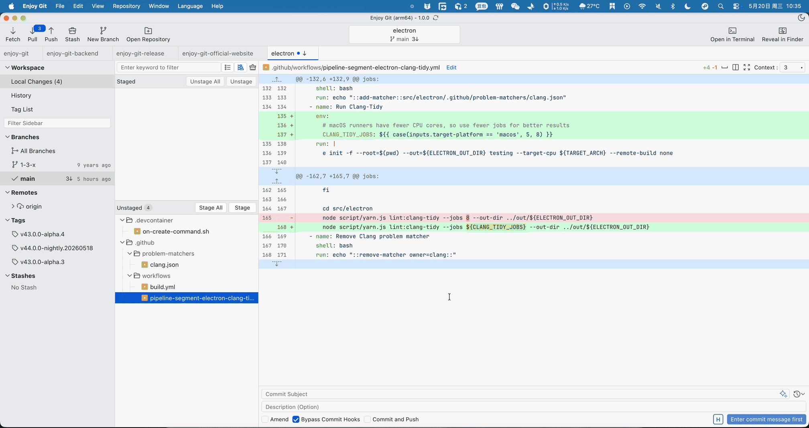
  </a>
</p>
<p align="center"><sub>典型工作流录屏（点击可查看原图）· 支持深色 / 浅色主题</sub></p>

三栏布局：左侧导航、中间文件列表、右侧 diff 与提交区；顶部可多标签同时打开多个仓库。

#### 顶部工具栏

| 操作 | 说明 |
|------|------|
| **获取（Fetch）** | 从远程拉取最新引用，不自动合并到当前分支 |
| **拉取（Pull）** | 拉取并整合远程变更（支持普通 / Rebase 模式） |
| **推送（Push）** | 打开 [推送对话框](#推送对话框)，配置分支、远程与推送选项 |
| **贮藏（Stash）** | 打开 [贮藏对话框](#贮藏对话框)，贮藏全部或部分文件 |
| **新建分支** | 从 HEAD、标签、提交或远程分支创建分支 |
| **添加本地仓库** | 将本机已有 Git 仓库加入工作区 |

#### 推送对话框

点击工具栏 **Push**、菜单 **Repository → Push**（`⇧⌘P`）或分支右键 **推送到远程仓库**，打开推送配置对话框。

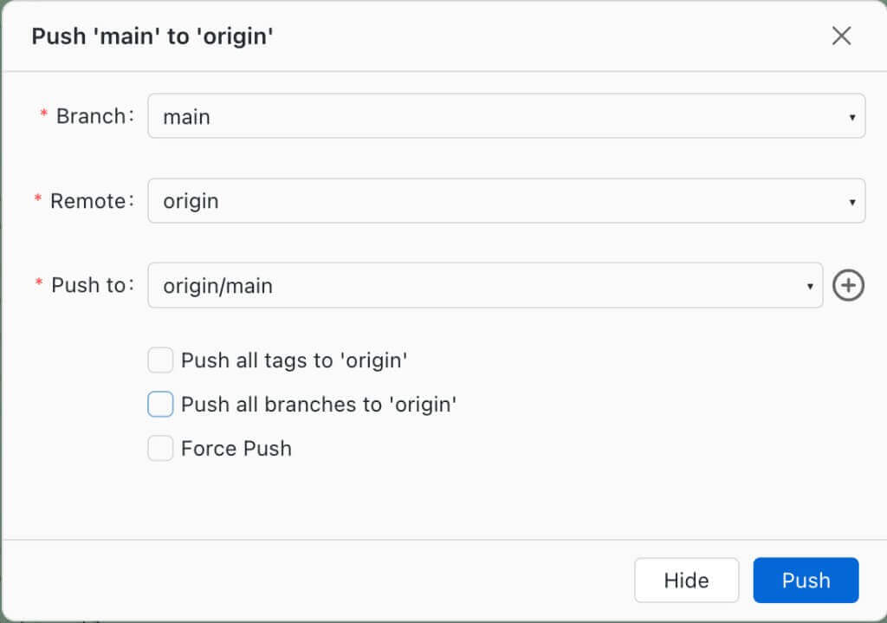

| 元素 | 说明 |
|------|------|
| 标题 | 如 `Push 'main' to 'origin'`，标明本地分支与目标远程 |
| **Branch**（必填） | 选择要推送的本地分支 |
| **Remote**（必填） | 选择目标远程（如 `origin`） |
| **Push to**（必填） | 推送到远程的哪条分支（如 `origin/main`）；右侧 **+** 可新建远程分支 |
| **Push all tags to 'origin'** | 一并推送所有本地标签 |
| **Push all branches to 'origin'** | 推送所有本地分支 |
| **Force Push** | 强制推送（`--force`，请谨慎使用） |
| **Push** | 执行推送 |
| **Hide** | 关闭对话框 |

#### 多仓库标签页

- 顶部标签同时打开多个仓库（如 `enjoy-git`、`electron` 等），一键切换
- 每个标签独立保留分支、暂存与视图状态

#### 系统快捷入口

| 入口 | 说明 |
|------|------|
| **在终端打开** | 在系统终端中打开当前仓库目录 |
| **在访达显示** / **资源管理器** | 在系统文件管理器中定位仓库根目录 |

#### 左侧工作空间

| 入口 | 说明 |
|------|------|
| **本地更改** | 显示未提交变更数量，进入暂存与提交流程 |
| **提交历史** | 查看提交图、列表与单次提交详情 |
| **标签列表** | 浏览与管理 Git 标签 |

侧栏还提供**本地分支**、**远程**、**标签**、**贮藏**树形列表，并支持关键词过滤。

---

## 支持平台

| 平台 | 版本 / 形态 | 架构 | Git |
|------|-------------|------|-----|
| **Windows** | Windows 10、Windows 11 | x64、arm64 | **内置**（dugite-native），开箱即用 |
| **macOS** | macOS 10.15 及以上 | x64（Intel 旧款 Mac）、arm64（Apple Silicon M1 及更新机型） | **内置**（dugite-native），开箱即用 |
| **Linux** | Debian 系（`.deb`）、Red Hat 系（`.rpm`） | x64、arm64 | 使用**系统环境**中的 Git，需预先安装 |

> **Git 说明**：Windows 与 macOS **已内置 Git**（dugite-native），安装后即可使用。Linux 需使用系统环境中的 Git，请提前安装（例如 `sudo apt install git`、`sudo dnf install git`），并确保终端可执行 `git` 命令。

---

## 支持的语言

应用界面支持以下三种语言，可在菜单栏 **Language** 中切换：

1. **简体中文**
2. **繁体中文**
3. **English（英语）**

文档另有 [繁體中文（香港）](./README.zh-HK.md) 版本。

---

## 支持的主题

1. **深色模式**
2. **浅色模式**

---

## 功能概览

| 模块 | 核心能力 |
|------|----------|
| 菜单栏 | File / View / Repository / Language / Help 完整菜单与快捷键 |
| 多仓库 | 标签页同时打开多个本地仓库，各自保留视图状态 |
| 工作区 | 已暂存 / 未暂存分区、**列表 / 文件树**切换查看、关键词过滤、文件右键操作 |
| 差异审阅 | 统一 / 双栏视图、语法高亮、行级暂存、上下文折叠、图片 diff |
| 提交 | 摘要与详情、Amend、跳过钩子、提交并推送、**AI 生成说明** |
| 历史 | 提交图、搜索筛选、提交详情、变更**列表/文件树**查看、目录快照、多选批量操作 |
| 分支 / 远程 | 检出、合并、变基、跟踪、重命名、远程 Fetch / 编辑 / 批量检出 |
| 标签 / 贮藏 | 标签检出与删除、贮藏应用 / 弹出 / 重命名 |
| 设置 | **外部程序**、**SSH 密钥**、**AI 提交**、日志与配置目录 |
| 高级 | Cherry-pick、Squash、Revert、Blame、可视化冲突解决 |

---

## 功能详解

### 一、工作区与暂存区

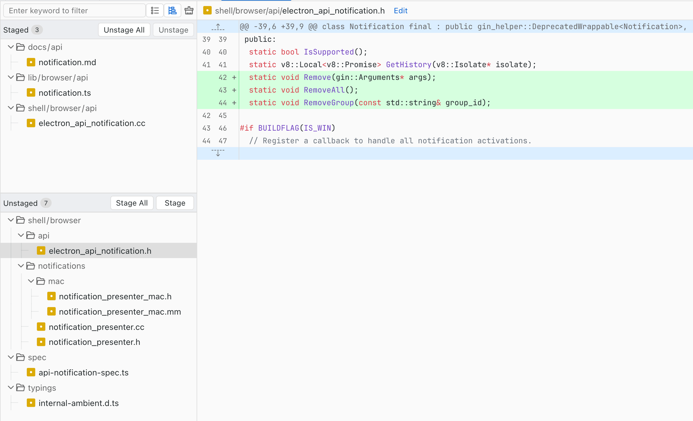

#### 文件列表

- **已暂存 / 未暂存** 分区展示，带数量角标
- **状态图标**：绿色「+」新增；黄色圆点已修改
- **变更统计**：显示变更文件数及总行数 `+新增 -删除`（如 `5 changed files +387 -8`）
- **关键词过滤**：顶部搜索框按文件名快速筛选

#### 列表 / 文件树查看

变更文件支持两种展示方式，通过筛选栏右侧图标一键切换（**本地更改**、**提交历史**中的变更列表均可用）：

| 视图 | 说明 |
|------|------|
| **列表视图** | 扁平列出所有变更文件，适合文件较少、快速定位 |
| **文件树视图** | 按目录层级折叠展示，适合大型变更、按模块浏览 |

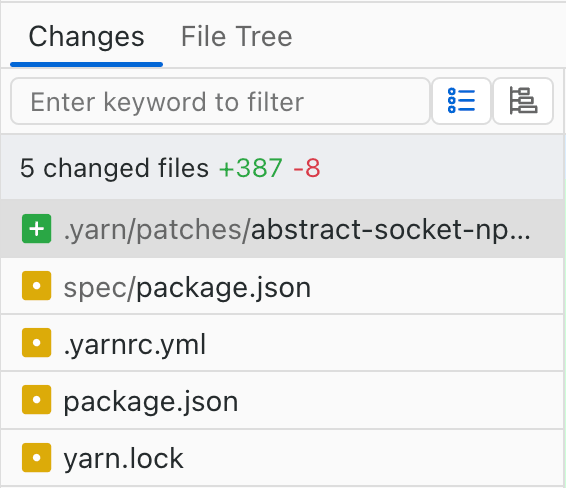

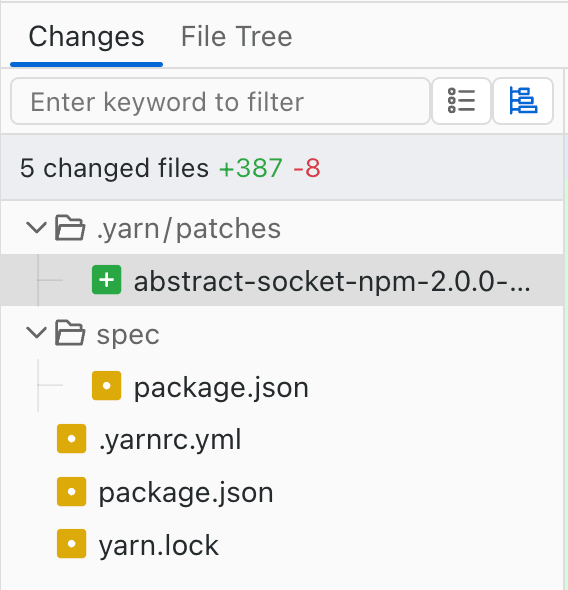

- 文件夹可展开 / 收起，子路径下的变更高亮显示
- 与 **Changes（差异文件）** / **File Tree（文件树）** 标签页配合：前者看本次变更列表，后者在提交历史中可查看该提交时刻的完整仓库目录快照

#### 批量操作

| 区域 | 按钮 | 说明 |
|------|------|------|
| 已暂存 | 取消暂存所有 / 取消所选暂存 | 移回未暂存区 |
| 未暂存 | 暂存所有 / 暂存所选 | 加入暂存区 |

#### 未暂存文件右键菜单

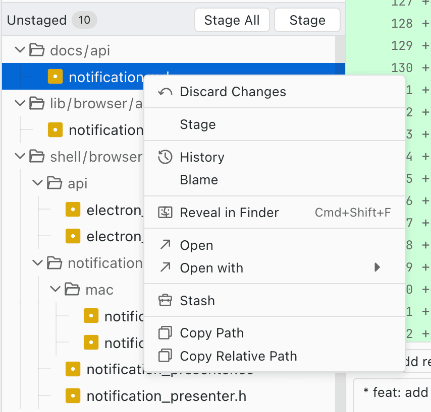

| 菜单项 | 说明 |
|--------|------|
| 丢弃更改 | 恢复为 HEAD 版本 |
| 暂存 | 将当前文件加入暂存区 |
| 历史记录 | 打开单文件提交历史 |
| 按行审阅 | `git blame` 行级溯源 |
| 在访达中显示 | `Cmd+Shift+F`（macOS；Windows / Linux 为对应系统文件管理器） |
| 打开 | 使用默认外部程序打开文件 |
| 打开方式 | 子菜单：选择 [外部打开程序](#外部打开程序) 中配置的编辑器 |
| 贮藏 | 贮藏当前文件（可区分已暂存 / 未暂存） |
| 复制路径 | 复制文件绝对路径 |
| 复制相对路径 | 复制相对于仓库根目录的路径 |

---

### 二、差异对比（Diff）

- **统一视图 / 双栏视图** 可切换，支持**忽略空格**
- **语法高亮**：Vue、JavaScript、TypeScript、Markdown、Python 等
- **变更高亮**：绿色 `+` 新增，红色 `-` 删除
- **图片 diff** 预览；**虚拟列表** 大文件也流畅
- 可在 diff 中**直接编辑**工作区文件

#### 双栏对比

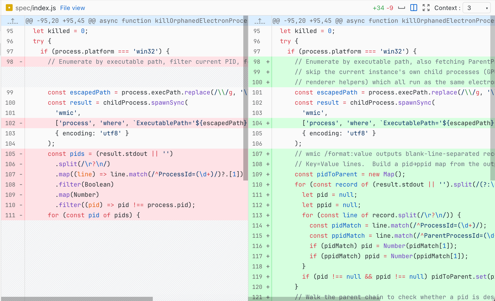

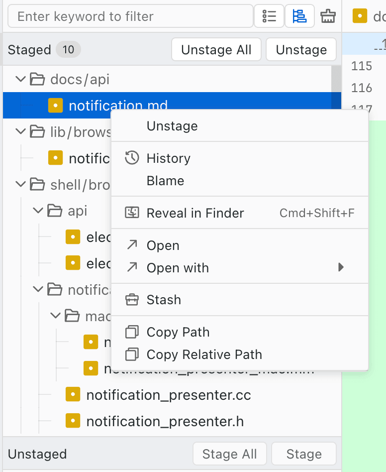

#### 上下文折叠

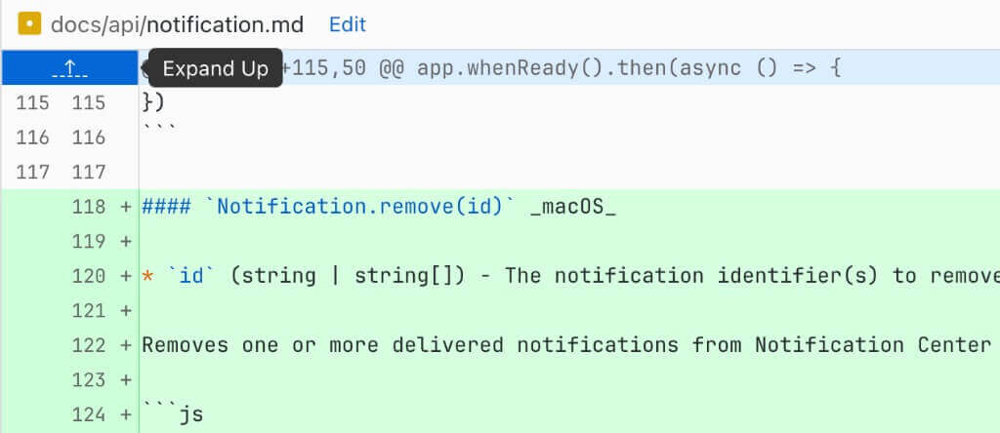

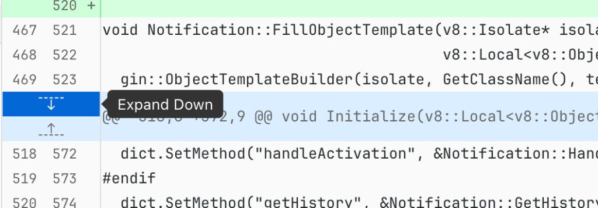

| 操作 | 说明 |
|------|------|
| 向上展开 | 向当前变更块上方展开更多上下文行 |
| 向下展开 | 向当前变更块下方展开更多上下文行 |

#### 行级暂存（Hunk 操作）

在 diff 中选中代码行（高亮显示）后右键，可进行行级暂存、取消暂存或丢弃等操作：

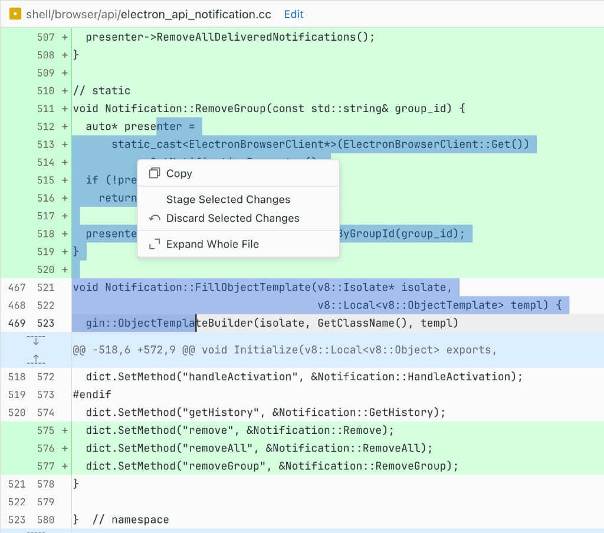

| 菜单项 | 说明 |
|--------|------|
| 复制 | 复制选中内容 |
| 将选中行加入暂存区 | 仅暂存选中行（部分提交） |
| 丢弃选中行 | 放弃选中行修改 |
| 展开整个文件 | 显示完整文件 diff |

已暂存文件中选中行时，菜单会显示「将选中行移出暂存区」。

---

### 三、提交

主界面底部提交区：

| 功能 | 说明 |
|------|------|
| 提交说明 | 单行摘要 + 可选详细描述 |
| AI 生成说明 | 根据暂存变更自动生成 commit message（需先在 [AI 提交消息](#ai-提交消息) 中配置模型） |
| 修改最后一次提交（Amend） | 将本次变更合并进上一次提交 |
| 跳过提交钩子 | 等效 `git commit --no-verify` |
| 提交并推送 | 提交后自动推送到远程 |
| 提交按钮 | 显示文件数与目标分支，如「提交 6 个文件到 'dev'」 |

存在未解决冲突时，按钮会提示「请先解决冲突」。

---

### 四、提交历史

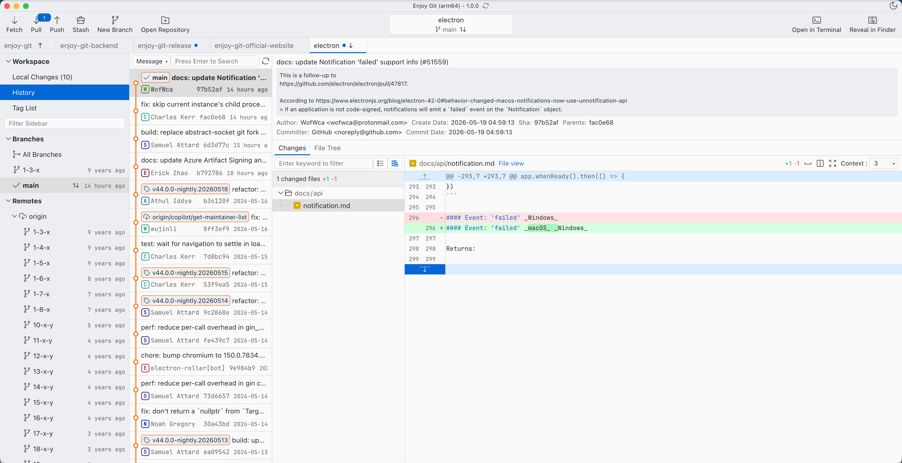

- **提交图（Graph）**：彩色线条与节点展示分支、合并关系
- **提交列表**：说明、作者头像、短 SHA、相对时间
- **搜索筛选**：按提交说明关键词搜索（回车触发）
- **分支筛选**：限定查看特定分支历史

#### 提交右键菜单

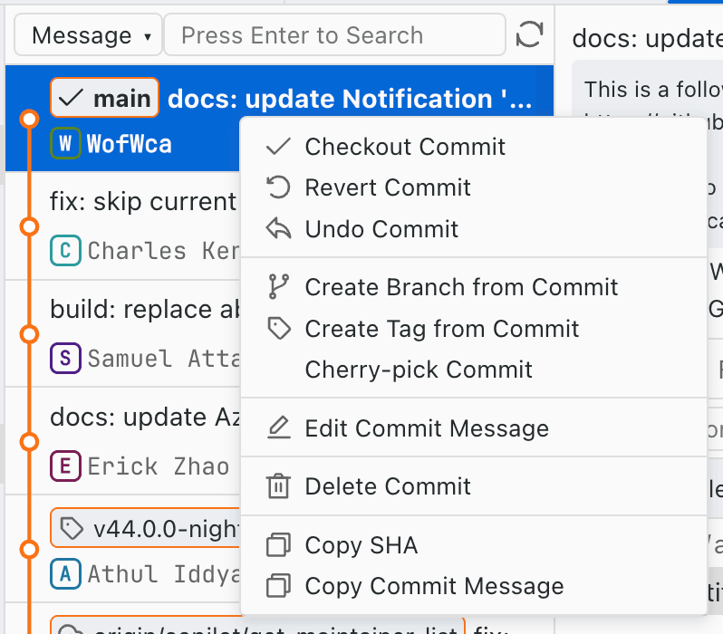

| 操作 | 说明 |
|------|------|
| 检出提交 | 切换到该提交（分离 HEAD） |
| 还原提交（Revert） | 生成反向提交 |
| 撤销提交（Undo） | 撤销最近一次提交并保留变更 |
| 从提交创建分支 / 标签 | 打开创建分支或打标签对话框 |
| 遴选提交（Cherry-pick） | 打开对话框，选择目标分支后应用变更 |
| 编辑提交说明 | 修改 commit message |
| 删除提交 | 从历史中移除 |
| 复制 SHA / 复制提交说明 | 快捷复制 |

#### 多选批量操作

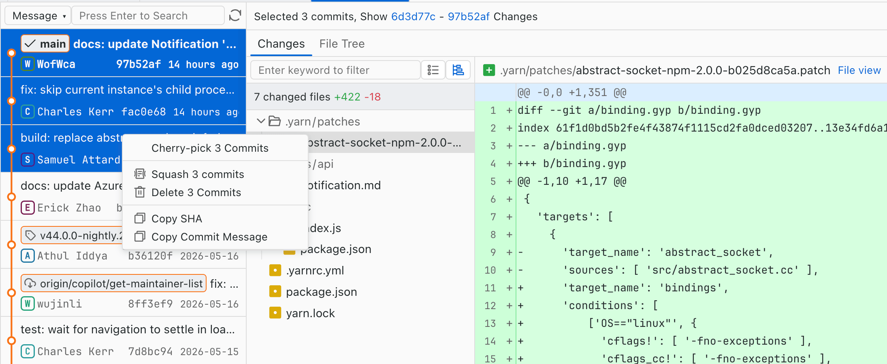

选中多个提交后可：**Cherry-pick**、**Squash 压缩**、**删除**、复制 SHA 与说明；右侧汇总显示变更文件与 diff。

#### 遴选提交（Cherry-pick）

在提交历史中单选或多选提交后，通过右键 **Cherry-pick Commit** 或批量菜单 **Cherry-pick N Commits** 打开遴选对话框，选择要将变更应用到的**目标分支**。

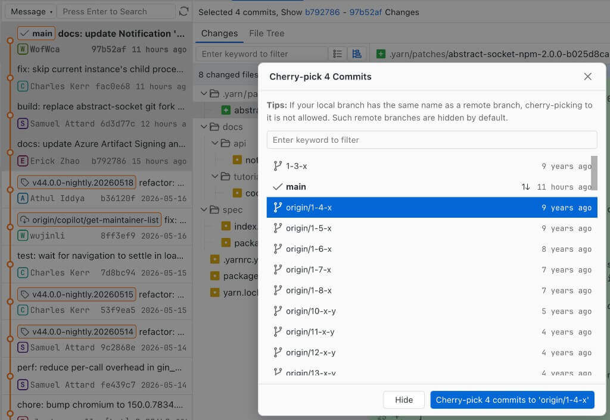

| 元素 | 说明 |
|------|------|
| 标题 | 显示待遴选的提交数量，如 `Cherry-pick 4 Commits` |
| 提示 | 若本地分支与远程分支同名，不允许遴选到该分支；此类远程分支默认隐藏 |
| 关键词过滤 | 在分支列表中快速搜索目标分支 |
| 分支列表 | 展示本地与远程分支，含相对时间；当前分支带勾选标记 |
| 确认按钮 | 文案随所选分支变化，如 `Cherry-pick 4 commits to 'origin/1-4-x'` |

确认后，所选提交的变更将依次应用到目标分支；若产生冲突，将进入 [冲突解决](#十二冲突解决) 流程。

#### 提交详情与文件浏览

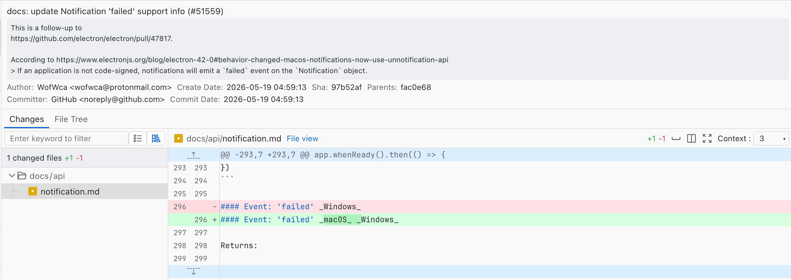

右侧面板展示完整说明、作者、邮箱、时间、SHA、父提交及 PR 链接等。

| 标签页 | 说明 |
|--------|------|
| **Changes（差异文件）** | 该次提交的变更文件；支持 [列表 / 文件树](#列表--文件树查看) 两种布局，显示 `+行数 -行数`，点击查看 diff |
| **File Tree（文件树）** | 该提交时刻的**完整**仓库目录快照（只读浏览） |

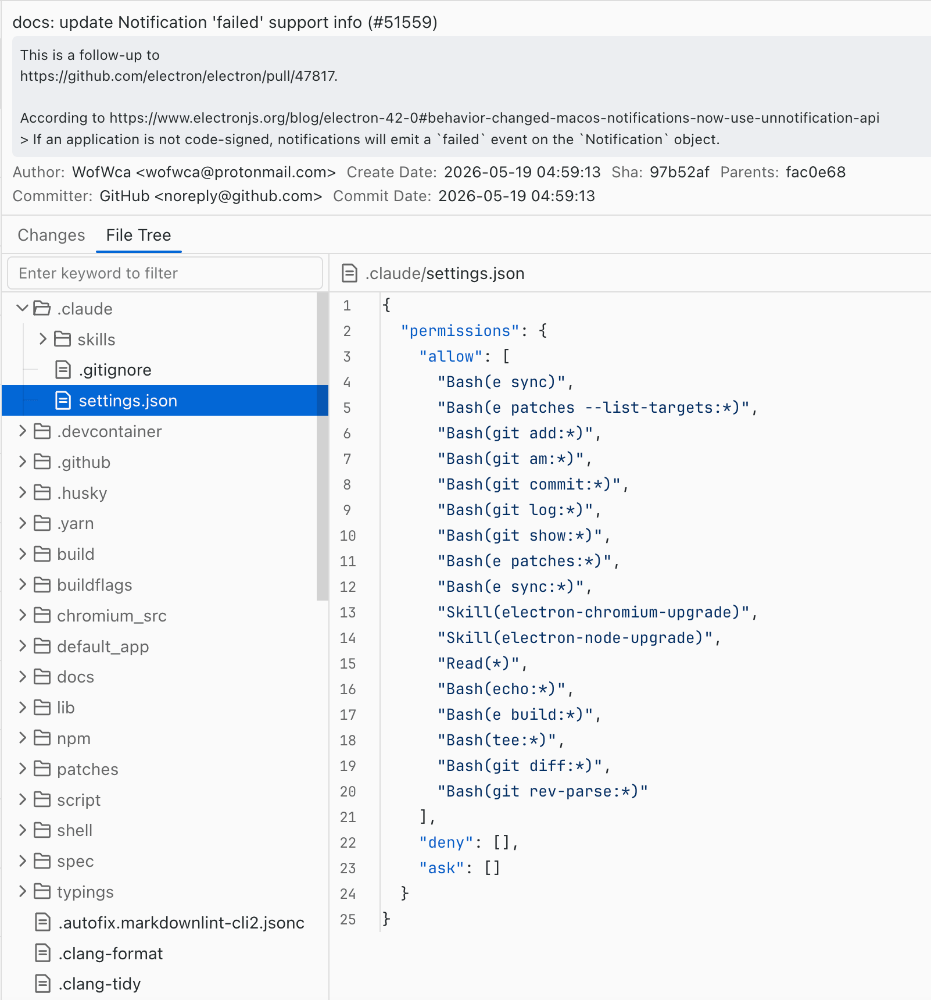

#### 历史文件右键菜单

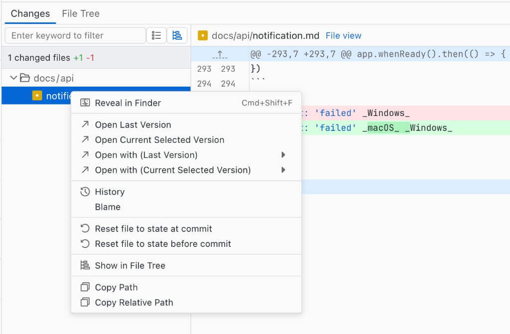

| 菜单项 | 说明 |
|--------|------|
| 在访达显示 | 定位文件 |
| 打开 · 最新版本 / 当前选定版本 | 对比不同版本 |
| 通过外部程序打开 | 子菜单选择应用 |
| 查看文件历史 / 按行审阅 | 历史与 blame |
| 将文件重置到提交时状态 / 提交前状态 | 回退文件 |
| 在文件树中显示 | 跳转到文件树并高亮 |
| 复制路径 / 复制相对路径 | 快捷复制 |

---

### 五、分支管理

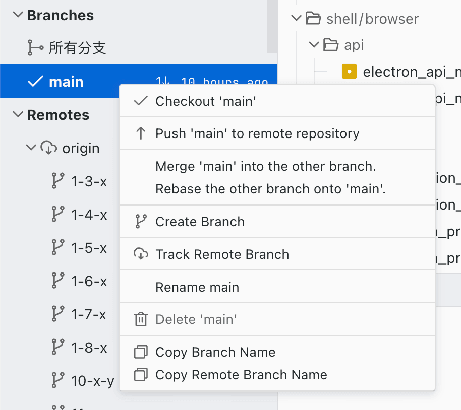

| 操作 | 说明 |
|------|------|
| 检出 | 切换到该分支 |
| 推送到远程仓库 | 打开 [推送对话框](#推送对话框) |
| 合并到另一个分支 | Merge |
| 将另一个分支变基到当前分支 | Rebase |
| 新建分支 | 打开 [创建分支](#新建分支对话框) 对话框 |
| 跟踪远程分支 | 建立 upstream 跟踪 |
| 重命名 / 删除 | 分支生命周期管理 |
| 复制分支名 / 复制远程分支名 | 快捷复制 |

支持从 **HEAD / 标签 / 提交 / 远程分支** 作为起点新建分支（工具栏 **新建分支**、侧栏按钮或右键 **Create Branch** 均可打开对话框）。

#### 新建分支对话框

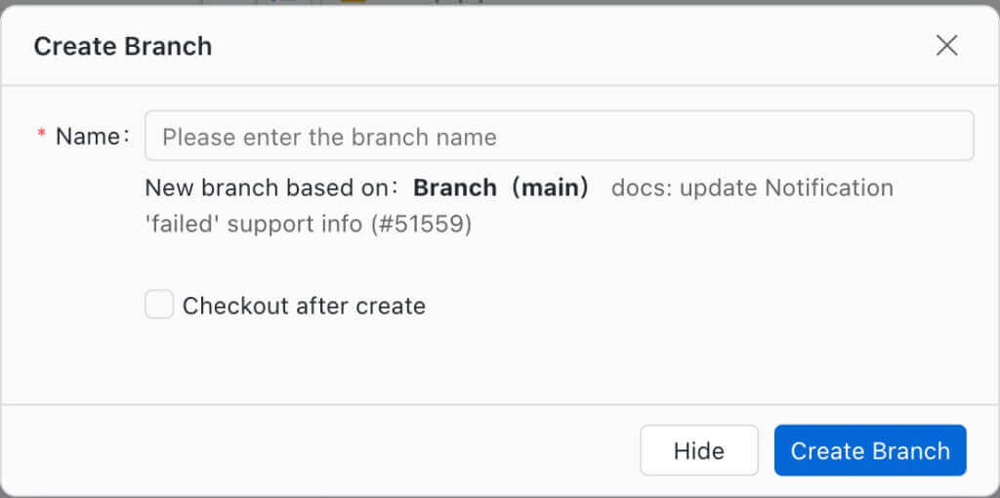

| 元素 | 说明 |
|------|------|
| **Name**（必填） | 输入新分支名称 |
| **New branch based on** | 显示创建起点类型与说明，如 `Branch (main) docs: update Notification...`，即基于某分支、提交或标签 |
| **Checkout after create** | 勾选后创建完成自动检出到新分支 |
| **Create Branch** | 确认创建 |
| **Hide** | 关闭对话框 |

创建起点取决于触发位置：在侧栏某分支上右键则基于该分支；在提交历史上右键 **Create Branch from Commit** 则基于该提交。

---

### 六、远程仓库管理

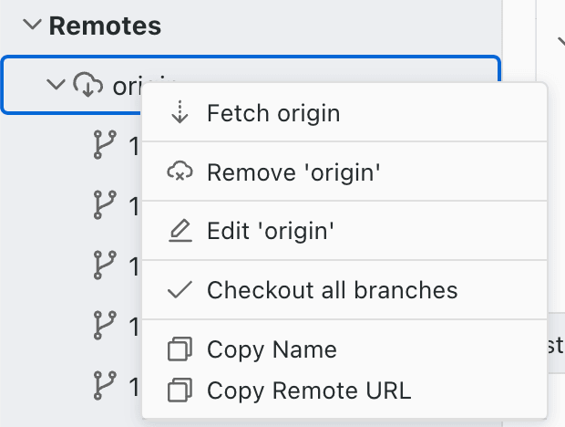

在远程名（如 `origin`）上右键：

| 操作 | 说明 |
|------|------|
| 获取 origin | 仅从该远程 Fetch |
| 编辑 origin | 修改名称或 URL（HTTP / SSH） |
| 取消关联 / 移除 | 删除远程配置 |
| 检出所有分支 | 为远程全部分支创建本地跟踪分支 |
| 复制名称 / 复制远程 URL | 快捷复制 |

支持**多个远程**的增删改查。侧栏 **Remotes** 区域可添加新远程，打开 [添加远程对话框](#添加远程对话框)。

#### 添加远程对话框

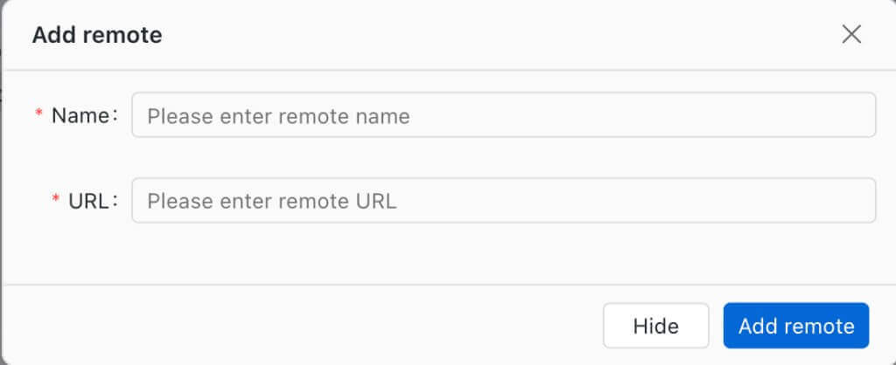

| 元素 | 说明 |
|------|------|
| **Name**（必填） | 远程名称，如 `origin`、`upstream` |
| **URL**（必填） | 远程仓库地址，支持 HTTPS / SSH |
| **Add remote** | 添加远程并保存配置 |
| **Hide** | 关闭对话框 |

添加成功后，可在侧栏展开该远程，执行 Fetch、检出分支或 [推送](#推送对话框) 等操作。

#### 远程分支

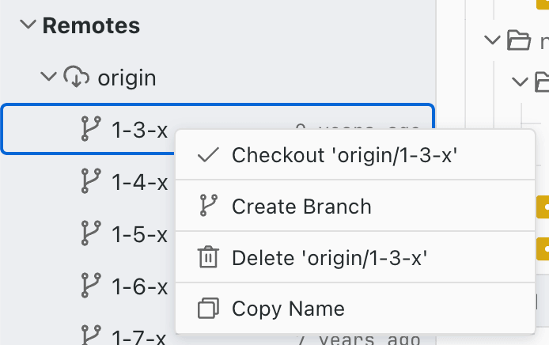

| 操作 | 说明 |
|------|------|
| 检出 | 检出远程跟踪分支 |
| 新建分支 | 基于远程分支创建本地分支 |
| 删除 | 删除远程分支 |
| 复制名称 | 复制分支名 |

---

### 七、标签管理

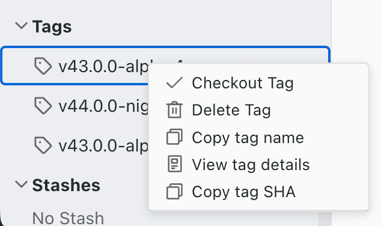

| 操作 | 说明 |
|------|------|
| 检出标签 | 切换到标签对应提交 |
| 删除标签 | 移除本地或远程标签 |
| 复制标签名 / 复制标签 SHA | 快捷复制 |
| 查看标签详情 | 查看关联提交与说明 |

侧栏 **标签列表** 支持搜索与筛选；可从提交历史右键**从提交创建标签**。

---

### 八、贮藏（Stash）管理

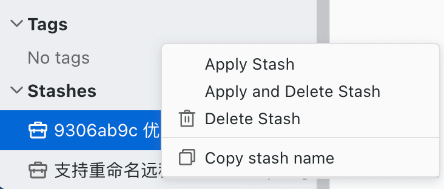

| 操作 | 说明 |
|------|------|
| 应用贮藏 | 应用变更，保留贮藏记录 |
| 应用并删除贮藏 | 等同 `git stash pop` |
| 删除贮藏 | 丢弃该条贮藏 |
| 复制贮藏名称 | 快捷复制 |

支持**重命名**贮藏以便识别。

#### 贮藏对话框

工具栏 **Stash** 或相关菜单可贮藏变更；文件右键 **将选中文件加入贮藏** 可只贮藏部分文件。贮藏时完整保留暂存区与工作区的区分状态。

##### 贮藏全部文件

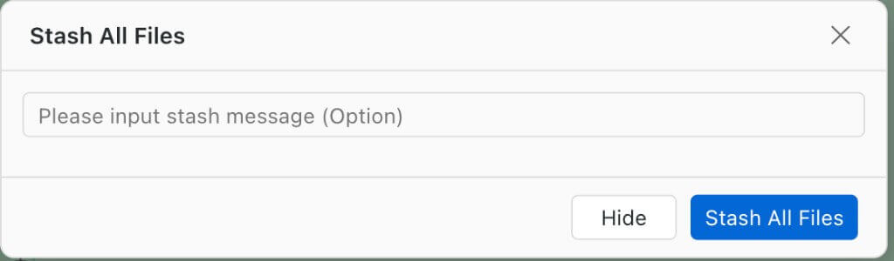

| 元素 | 说明 |
|------|------|
| 标题 | `Stash All Files` |
| 说明输入 | 可选贮藏说明（`Please input stash message (Option)`） |
| **Stash All Files** | 将当前所有未提交变更一并贮藏 |
| **Hide** | 关闭对话框 |

##### 贮藏部分文件

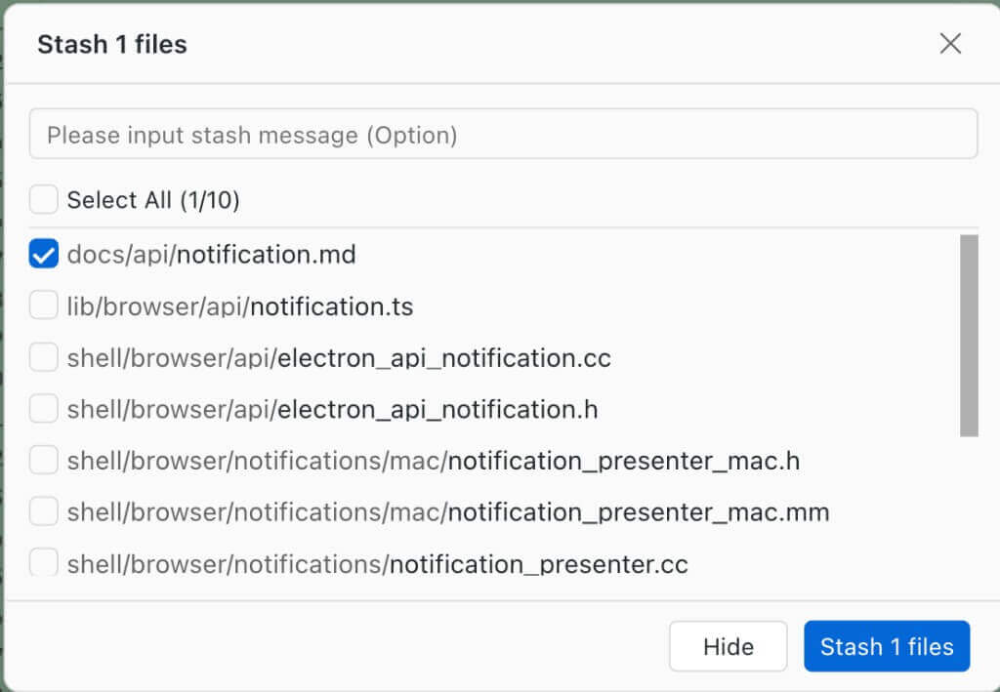

| 元素 | 说明 |
|------|------|
| 标题 | 显示待贮藏文件数，如 `Stash 1 files` |
| 说明输入 | 可选贮藏说明 |
| **Select All (N/M)** | 全选 / 取消全选；`N` 为已选数，`M` 为可选文件总数 |
| 文件列表 | 勾选要贮藏的文件（含已暂存与未暂存） |
| **Stash N files** | 仅贮藏勾选的文件 |
| **Hide** | 关闭对话框 |

从文件右键进入时，默认勾选当前选中文件；也可在列表中增删其他文件。

---

### 九、克隆与仓库接入

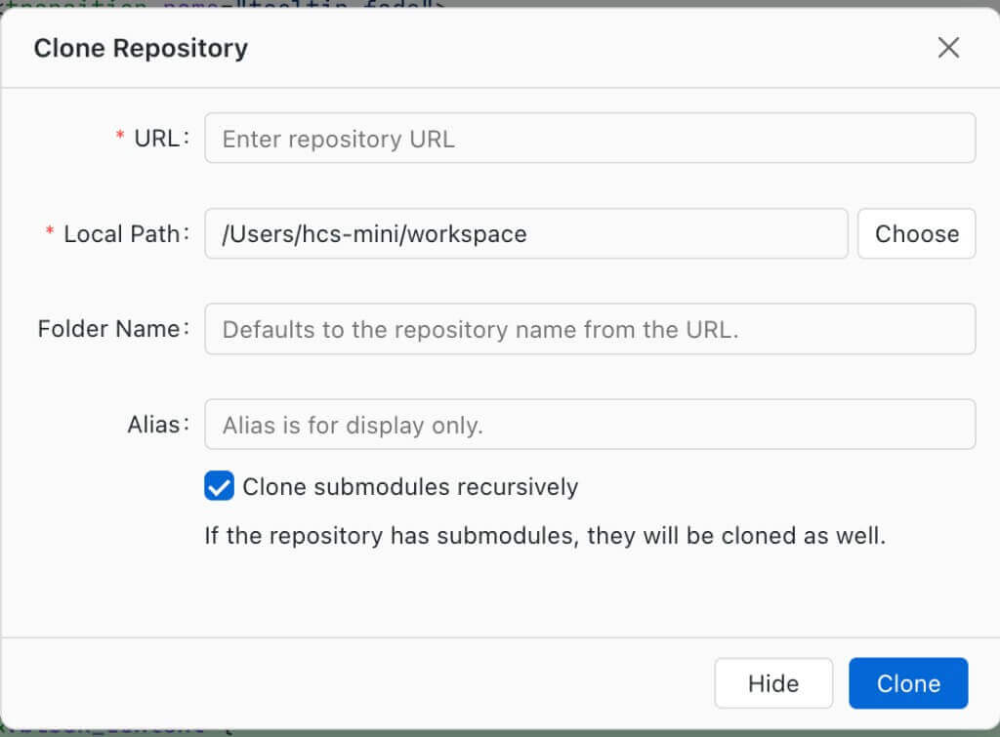

| 字段 | 说明 |
|------|------|
| 仓库 URL（必填） | HTTPS / SSH |
| 本地目录（必填） | 克隆目标父目录 |
| 目标文件夹 | 默认可从 URL 推导 |
| 仓库别名 | 仅用于应用内显示 |
| 递归克隆子模块 | 一并克隆 Submodule |

- **添加本地仓库**：打开本机已有 Git 项目
- **Git**：Windows / macOS 使用应用**内置 Git**（dugite-native）；Linux 使用系统已安装的 Git
- 克隆失败时提供权限与网络相关的详细错误提示

---

### 十、按行审阅（Blame）与文件历史

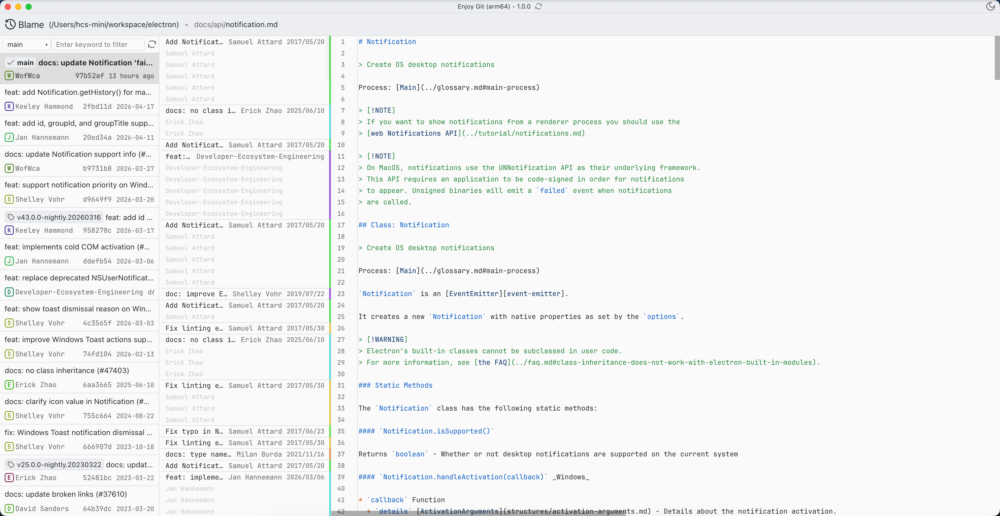

**按行审阅（Blame）** 独立窗口：

- 左侧：影响该文件的所有提交列表，支持关键词过滤
- 中间：每行显示最后修改者与日期
- 右侧：带语法高亮的文件内容
- 顶部分支选择器可切换分支

**文件历史记录**：从文件右键进入，查看单文件完整提交链及每次 diff。

---

### 十一、冲突解决

**合并、变基、拉取、贮藏应用、遴选**等任意产生冲突的操作，均提供同一套可视化解决能力，无需区分场景。

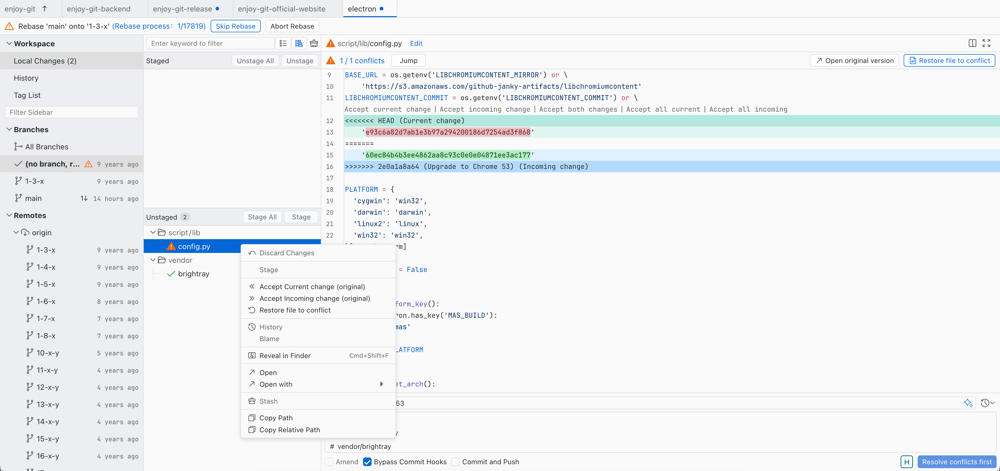

| 能力 | 说明 |
|------|------|
| 冲突文件标识 | 侧栏与文件列表以警告图标标出待解决文件 |
| 分块解决 | 编辑器内高亮冲突块，支持**接受当前 / 接受传入 / 接受双方** |
| 批量接受 | 一键 **Accept all current / Accept all incoming** |
| 冲突导航 | 显示 `1/N conflicts`，支持 Jump 跳转到下一处 |
| 流程控制 | 进行中的操作（如变基）可**跳过当前步骤**或**中止**整个流程 |
| 提交区联动 | 未解决完冲突时，提交按钮提示「请先解决冲突」 |

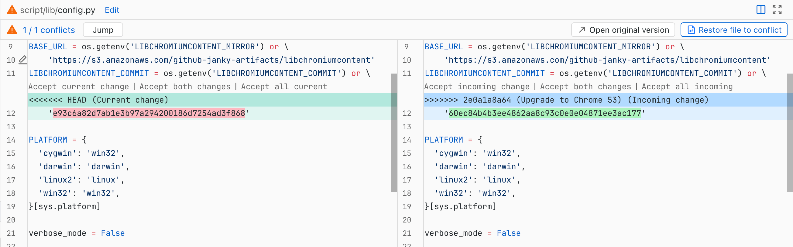

- 左右并排对比「当前版本」与「传入版本」
- 类 VS Code 的冲突标记与行内操作按钮

---

### 十二、其他能力

| 类别 | 能力 |
|------|------|
| Cherry-pick | 单个或批量遴选提交 |
| Squash | 多选提交压缩为一个 |
| 重置 | 软重置、硬重置、撤销提交 |
| 性能 | 提交列表、diff、文件树采用虚拟列表，适合大型仓库 |
| 内置 Git | Windows / macOS 基于 dugite-native 内置，开箱即用；Linux 依赖系统环境中的 Git |

---

## 菜单栏

应用提供完整的菜单栏，常用操作均可通过菜单或快捷键完成（以下为 macOS 示例，Windows / Linux 菜单位置可能略有不同）。

### Enjoy Git（应用菜单）

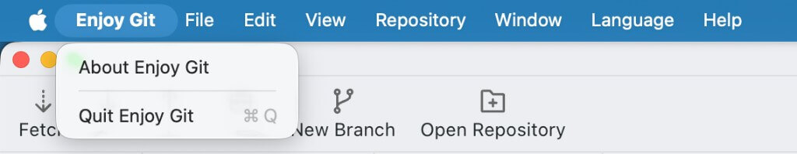

| 菜单项 | 说明 |
|--------|------|
| About Enjoy Git | 查看版本与关于信息 |
| Quit Enjoy Git | 退出应用（`⌘Q`） |

### File（文件）

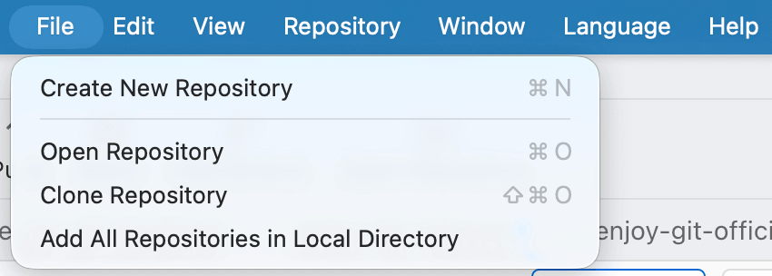

| 菜单项 | 快捷键 | 说明 |
|--------|--------|------|
| Create New Repository | `⌘N` | 在本地新建空仓库 |
| Open Repository | `⌘O` | 打开已有本地仓库 |
| Clone Repository | `⇧⌘O` | 克隆远程仓库 |
| Add All Repositories in Local Directory | — | 批量添加指定目录下的所有 Git 仓库 |

### View（视图）

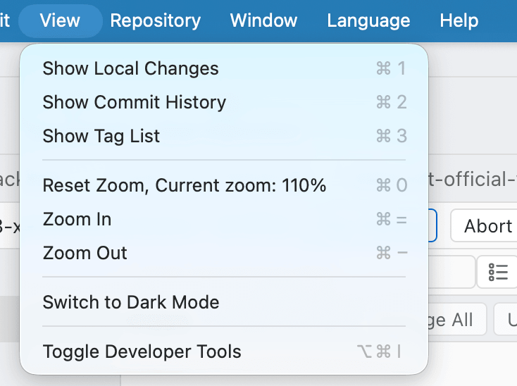

| 菜单项 | 快捷键 | 说明 |
|--------|--------|------|
| Show Local Changes | `⌘1` | 切换到本地更改视图 |
| Show Commit History | `⌘2` | 切换到提交历史视图 |
| Show Tag List | `⌘3` | 切换到标签列表视图 |
| Reset Zoom | `⌘0` | 重置界面缩放（显示当前比例，如 110%） |
| Zoom In / Zoom Out | `⌘=` / `⌘-` | 放大 / 缩小界面 |
| Switch to Dark Mode / Light Mode | — | **切换深色 / 浅色主题** |
| Toggle Developer Tools | `⌥⌘I` | 打开开发者工具 |

### Repository（仓库）

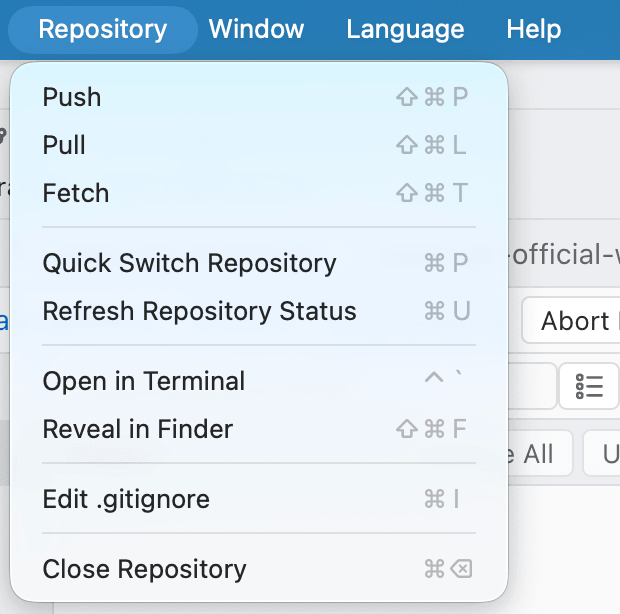

| 菜单项 | 快捷键 | 说明 |
|--------|--------|------|
| Push | `⇧⌘P` | 推送到远程 |
| Pull | `⇧⌘L` | 从远程拉取 |
| Fetch | `⇧⌘T` | 获取远程更新 |
| Quick Switch Repository | `⌘P` | 快速切换已打开的仓库 |
| Refresh Repository Status | `⌘U` | 刷新仓库状态 |
| Open in Terminal | `⌃\`` | 在终端中打开当前仓库 |
| Reveal in Finder | `⇧⌘F` | 在访达 / 资源管理器中显示仓库 |
| Edit .gitignore | `⌘I` | 编辑 `.gitignore` |
| Close Repository | `⌘⌫` | 关闭当前仓库标签 |

### Language（语言）

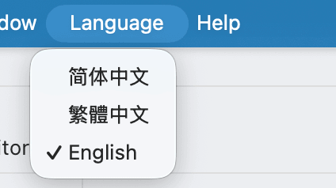

在 **Language** 菜单中勾选一种界面语言，立即生效：

- 简体中文
- 繁體中文
- English

### Help（帮助）

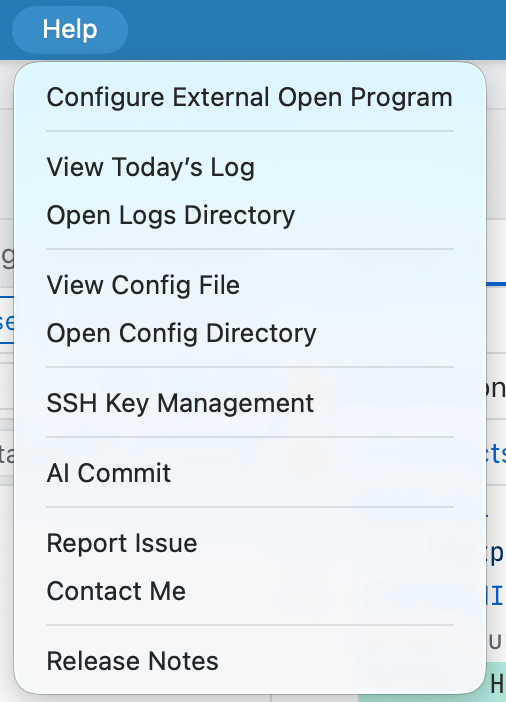

| 菜单项 | 说明 |
|--------|------|
| Configure External Open Program | 配置外部打开程序（见下文） |
| View Today's Log | 查看当日日志 |
| Open Logs Directory | 打开日志目录 |
| View Config File | 查看配置文件 |
| Open Config Directory | 打开配置目录 |
| SSH Key Management | SSH 密钥管理（见下文） |
| AI Commit | AI 提交消息配置（见下文） |
| Report Issue | 反馈问题 |
| Contact Me | 联系开发者 |
| Release Notes | 查看发行说明 |

---

## 设置与工具

以下功能均从 **Help** 菜单进入。

### 外部打开程序

可将 Cursor、VS Code、Trae 等编辑器注册为外部程序，在文件右键 **打开**、**通过外部程序打开** 时使用；支持设置一个**默认**程序。

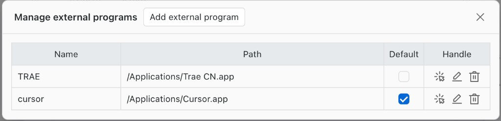

| 能力 | 说明 |
|------|------|
| 添加外部程序 | 选择本机已安装的应用（`.app` / 可执行文件） |
| 编辑 / 删除 | 维护名称与路径 |
| 设为默认 | 勾选 Default，作为「打开」时的首选 |
| 使用场景 | 工作区文件、历史版本、提交快照中的文件均可外部打开 |

### SSH 密钥管理

便于配置访问 Git 远程仓库（GitHub、GitLab 等）所需的 SSH 公钥，无需手动编辑 `~/.ssh`。

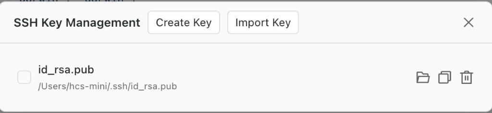

| 能力 | 说明 |
|------|------|
| Create Key | 在应用内生成新的 SSH 密钥对 |
| Import Key | 导入本机已有密钥 |
| 密钥列表 | 显示公钥文件名与路径（如 `id_rsa.pub`） |
| 快捷操作 | 打开所在文件夹、复制公钥内容、删除密钥 |

### AI 提交消息

接入大模型，根据暂存变更**自动生成提交说明**，减少手写 commit message 的时间。

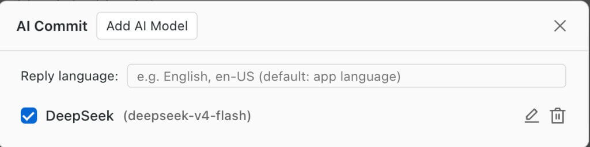

| 配置项 | 说明 |
|--------|------|
| Reply language | 生成说明的语言（如 `English`、`zh-CN`；留空则跟随应用界面语言） |
| AI 模型列表 | 可添加多个模型，勾选一个作为当前使用 |
| Add AI Model | 新增模型配置 |

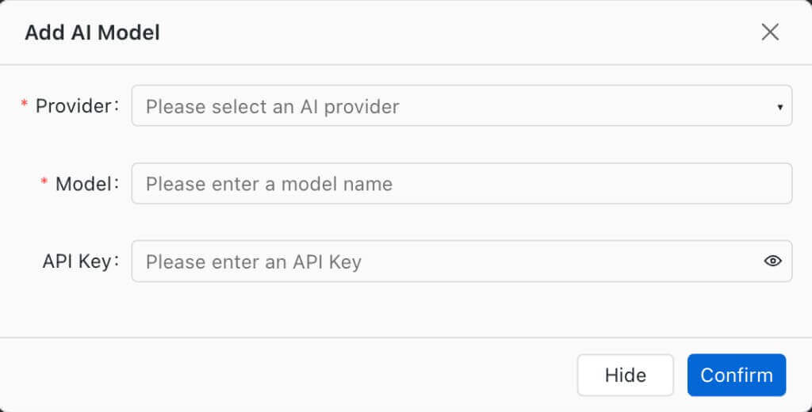

添加模型时需填写：

| 字段 | 说明 |
|------|------|
| Provider | 选择 AI 服务商（必填） |
| Model | 模型名称，如 `deepseek-chat`（必填） |
| API Key | 对应服务的 API 密钥 |

配置完成后，在提交区域即可使用 AI 生成提交说明（具体入口以应用内按钮为准）。

---

## 常见问题

关于 Enjoy Git 的一些常见疑问解答。

### Enjoy Git 与其他 Git 客户端相比有什么优势？

Enjoy Git 专注于提供更直观的用户界面和更全面的功能支持，特别是在**冲突解决**、**部分提交**和**文件历史追踪**方面有独特优势。将复杂的 Git 命令封装成简单的可视化操作，同时保留了高级功能的可访问性，让无论是新手还是资深开发者都能高效使用。

### Enjoy Git 是否监听您的数据？

Enjoy Git **不会监视**您的仓库内容。您在 Enjoy Git 上管理的所有项目归您所有，Git 操作、凭证与日志主要保存在您的计算机上，不会上传用于读取您的提交或仓库文件。关于每日活跃设备等基础使用统计，请参阅[隐私政策](https://enjoygit.com/privacyPolicy.html)。

### 如何获取帮助或报告问题？

- 提交 [GitHub Issue](https://github.com/huangcs427/enjoy-git-release/issues)
- 邮件联系：[huangcs427@163.com](mailto:huangcs427@163.com)

---

## 下载与安装

- 前往 [GitHub Release](https://github.com/huangcs427/enjoy-git-release/releases) 下载对应平台与架构的安装包

按安装向导完成安装即可。

---

## 使用帮助

- 遇到问题？提交 [GitHub Issue](https://github.com/huangcs427/enjoy-git-release/issues)

---

## dugite-native 调用源代码

```ts
/**
 * 本软件内置的Git使用了dugite-native
 * 项目地址：https://github.com/desktop/dugite-native
 * 本文件包含了获取git路径和环境变量的函数，以及导出git命令函数的代码。
 */
import { spawn } from 'child_process';
import * as fs from 'fs-extra';
import * as path from 'path';

// 获取windows的git实例子目录，根据架构返回不同的目录
const getWin32GitSubfolder = (arch?: string): string => {
  const archRes = arch || process.arch
  if (archRes === 'x64') {
    return 'mingw64'
  } else if (archRes === 'arm64') {
    return 'clangarm64'
  } else {
    return 'mingw32'
  }
}

// 获取git路径和环境变量
interface TObjectValue {
  [key: string]: any
}
const getGitPathAndGitEnv = (envTemp?: TObjectValue) => {
  let env = { ...process.env, ...(envTemp || {}) }
  // 此处假设gitFolder为当前文件夹下的git文件夹
  const gitFolder = path.join(__dirname, 'git')
  let gitPath = ''
  // windows下，git路径为gitFolder\cmd\git.exe
  if (process.platform === 'win32') {
    const win32GitSubfolder = getWin32GitSubfolder()
    gitPath = path.join(gitFolder, 'cmd', 'git.exe')
    env.GIT_EXEC_PATH = path.join(gitFolder, win32GitSubfolder, 'libexec', 'git-core')
    env.PATH = `${gitFolder}\\${win32GitSubfolder}\\bin;${gitFolder}\\usr\\bin;${env.PATH ?? ''}`
  } else {
    // 其他平台下，git路径为gitFolder\bin\git
    gitPath = path.join(gitFolder, 'bin', 'git')
    env.GIT_CONFIG_SYSTEM = path.join(gitFolder, 'etc', 'gitconfig')
    env.GIT_EXEC_PATH = path.join(gitFolder, 'libexec', 'git-core')
    env.GIT_TEMPLATE_DIR = path.join(gitFolder, 'share', 'git-core', 'templates')
  }
  // 如果git路径不存在，使用系统git
  if (!fs.existsSync(gitPath)) {
    env = { ...envTemp }
    gitPath = 'git'
  }
  return { env, gitPath }
}

// 导出git命令函数
export const git = (args: string[], options: TObjectValue) => {
  if (!options) options = {}
  const { gitPath, env } = getGitPathAndGitEnv(options.env)
  options.env = env
  return spawn(gitPath, args, options)
}
```

---

## 反馈与建议

欢迎通过以下方式提出宝贵意见：

- 提交 [GitHub Issue](https://github.com/huangcs427/enjoy-git-release/issues)
- 邮件联系：huangcs427@163.com
- [隐私政策](https://enjoygit.com/privacyPolicy.html)